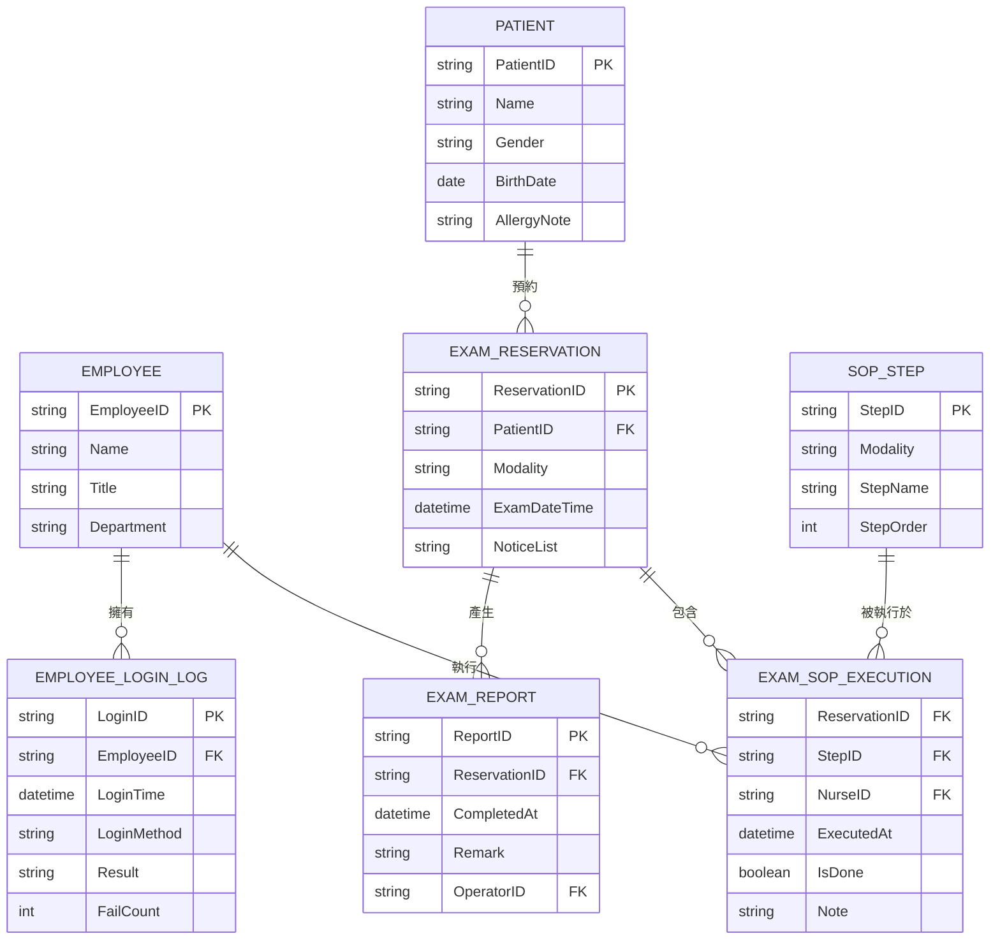

# CareSight 護理資訊系統 ERD

## 實體與屬性

- **Employee（員工）**  
  - EmployeeID（主鍵）  
  - Name（姓名）  
  - Title（職稱）  
  - Department（單位）  

- **Patient（病患）**  
  - PatientID（病歷號，主鍵）  
  - Name（姓名）  
  - Gender（性別）  
  - BirthDate（生日）  
  - AllergyNote（過敏史）  

- **ExamReservation（檢查預約）**  
  - ReservationID（預約編號，主鍵）  
  - PatientID（病歷號，外鍵 → Patient）  
  - Modality（檢查類型：CT／MRI／X 光…）  
  - ExamDateTime（預約檢查時間）  
  - NoticeList（注意事項：禁食／顯影劑／過敏提醒）  

- **ExamReport（檢查回報）**  
  - ReportID（回報編號，主鍵）  
  - ReservationID（預約編號，外鍵 → ExamReservation）  
  - CompletedAt（完成時間）  
  - Remark（備註說明）  
  - OperatorID（操作員工編號，外鍵 → Employee）  

- **EmployeeLoginLog（員工登入紀錄，組合實體）**  
  - LoginID（登入紀錄編號，主鍵）  
  - EmployeeID（員工編號，外鍵 → Employee）  
  - LoginTime（登入時間）  
  - LoginMethod（登入方式：密碼／指紋／臉部／語音）  
  - Result（結果：成功／失敗）  
  - FailCount（連續失敗次數）  

- **SOPStep（SOP 步驟）**  
  - StepID（步驟編號，主鍵）  
  - Modality（適用檢查類型）  
  - StepName（步驟名稱）  
  - StepOrder（步驟順序）  

- **ExamSOPExecution（檢查 SOP 執行紀錄，組合實體）**  
  - ReservationID（預約編號，外鍵 → ExamReservation）  
  - StepID（步驟編號，外鍵 → SOPStep）  
  - NurseID（護理師員工編號，外鍵 → Employee）  
  - ExecutedAt（實際執行時間）  
  - IsDone（是否完成，布林值）  
  - Note（補充說明）  
  - ※ 可將 ReservationID + StepID 視為複合主鍵

## ERD

